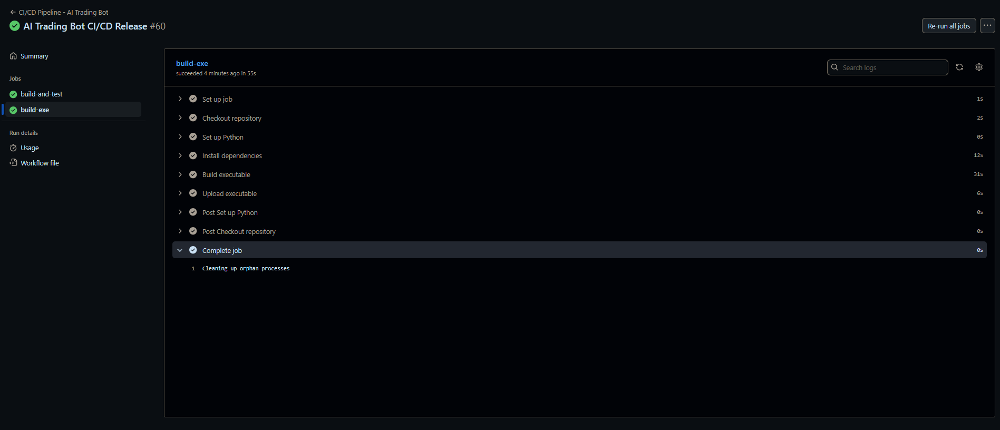

# AI Trading Bot - Pro GUI

This project is a **showcase of my skills as a developer and QA Engineer**, blending **AI-driven crypto analysis** (via OpenAI GPT models), **real-time price data**, **news aggregation**, and a **custom GUI built with Tkinter**.

Hey there, I’m **Eduardo Gallifa** — a Manual QA Engineer transitioning into automation (because, let’s be real: smarter work and better pay). I’m also an Industrial Engineer. I’ve been into crypto since 2018 — saw BTC at 20k and now over 100k. Wild ride.

This repo started as my **personal playground** to experiment with **automation, APIs, AI, and smart integrations**. I see APIs as engines that speak JSON — and I enjoy building the gearbox.

The **OpenAI API** acts as the brain, **Binance delivers live market data**, and **CryptoPanic provides global news signals**. Combined, they create:  
**An AI-powered crypto assistant with real market awareness.** 😎

Although the bot is fully functional, I’ve decided to **freeze development here** and move on to building a **Custom GPT connected to APIs** — the natural evolution of this idea.
---
## **CI/CD & Real-Time API Testing**

This project leverages a **full CI/CD pipeline with GitHub Actions**, performing:

- **Real-time API validation** for Binance and OpenAI endpoints.
- **Automated testing** on every push, pull request, and release.
- **Executable build generation** via PyInstaller, uploaded as downloadable artifacts on releases.


**Why is this important?**  
It ensures the bot is continuously tested, the APIs remain functional, and builds are always ready for deployment.

---

---

## 🧠 Showcase Note

This project is **archived as a portfolio piece**.  
It demonstrates:

- **API integrations** (Binance, CryptoPanic, OpenAI).
- **AI prompt engineering**.
- **Tkinter-based GUI design**.
- **Data analysis & storage logic**.

I’ve decided to evolve this idea into a **Custom GPT connected to APIs**,  
focusing on **real-time AI-driven trading insights**.

---

## **Features**

### **1. AI-Powered Crypto Analysis**
- Uses **OpenAI GPT-4o** to generate market insights and recommendations.
- Analyzes **daily, weekly, and monthly perspectives** for popular cryptocurrencies:  
  **BTC, ETH, BNB, SOL, XRP.**
- Provides **Buy/Hold/Sell recommendations** with **Take-Profit (TP)** and **Stop-Loss (SL)** hints (for spot trading).
- Supports **PnL (Profit and Loss) calculations** if the user provides a buy price.

### **2. Real-Time Market Data**
- Fetches **live prices** using Binance API.
- Displays **last 3 daily closes** for each tracked cryptocurrency.
- Integrates a **news fetcher** to pull the latest crypto headlines (via CryptoPanic API).

### **3. Pattern Recognition**
- Includes a custom **pattern analysis module** that detects basic technical patterns (e.g., bullish/bearish signals).
- Combines pattern data with AI analysis for smarter suggestions.

### **4. GUI Application (Tkinter)**
- A fully functional **desktop interface** with the following panels:
  - **Dashboard:** Shows current prices, recommendations, and AI suggestions for each crypto.
  - **Chat Section:** Interactive chat with the AI trading assistant.
  - **Control Panel:** Dropdown menus for **Trading Mode** (`daily`, `weekly`, `monthly`) and **Trade Type** (`spot`, `futures`).
  - **Action Buttons:** Trigger quick actions, refresh data, and run AI analysis on demand.
- **Dropdowns locked (`readonly`)** to prevent accidental user input errors.

### **5. Logging & Reports**
- Automatically saves AI reports and analysis results into a local **SQLite database**.
- Generates summaries of news + technical analysis in each session.

---

## **Tech Stack**

- **Python 3.10+**
- **Tkinter** (for GUI)
- **OpenAI API (GPT-4o)** for AI-driven analysis.
- **Binance API** for live prices.
- **CryptoPanic API** for news aggregation.
- **SQLite** for storing logs and reports.
- **dotenv** for managing environment variables (API keys).
- **Custom Modules:**  
  - `services/price_fetcher.py`  
  - `services/news_fetcher.py`  
  - `services/report_generator.py`  
  - `analytics/patterns.py`  

---

## **How to Run**

1. Clone the repository:
   ```plaintext
   git clone https://github.com/eduardogallifaochoa/ai-trading-bot.git
   cd ai-trading-bot
   ```
2. Create the virtual environment, and install dependencies:
```plaintext
  python -m venv venv
  source venv/bin/activate  # or venv\Scripts\activate on Windows
  pip install -r requirements.txt
```
3. Add your api keys in the .env file:
```plaintext
OPENAI_API_KEY=your_openai_key
```
4. Launch the GUI:
```plaintext
python gui_launcher.py
```


## 📦 **Project Structure**
```plaintext
ai-trading-bot/
├── bot.py                   ← Classic bot (CLI)
├── gui_launcher.py          ← GUI launcher
├── generate_report.py       ← Report generator
├── services/                ← APIs & AI logic
├── analytics/               ← Pattern detection
├── database/                ← SQLite database helpers
├── utils/                   ← Tools (cleanup)
├── crypto_summaries.db      ← Saved AI reports
├── price_log.txt            ← Price logs (3-min intervals)
├── requirements.txt         ← Packages
├── .env                     ← API keys
└── dist/                    ← Windows executable
```

## ⚙️ How to Use It
Option 1: GUI (Recommended for non-coders)
```plaintext
python gui_launcher.py
From here, you can click buttons like Generate Report, Analyze Patterns, or Show History.
```
Option 2: CLI (Command Line)
```plaintext
# Generate a custom report
python generate_report.py "Analyze BTC market for the weekend"
```
# Show historical reports
```plaintext
python generate_report.py --history
```
# Analyze historical patterns (BUY / HOLD / SELL)
```plaintext
python generate_report.py --patterns
```
# Clean database from errors
```plaintext
python generate_report.py --clean
```
Option 3: Classic Bot
```plaintext
python bot.py
Ask natural-language crypto questions directly.
```
## ⚡ CI/CD Pipeline

This project includes a **GitHub Actions CI/CD pipeline** that ensures stability and build automation:

- **CI:**  
  - Installs dependencies from `requirements.txt`.  
  - Runs unit tests with `pytest` to validate:
    - Binance API endpoints (mocked live price checks).
    - OpenAI API responses (mocked).  
    - Logger functionality (price log generation).  

- **CD:**  
  - Builds a standalone Windows executable (`ai_bot.exe`) using **PyInstaller**.  
  - Uploads the executable as a downloadable artifact on GitHub Releases.

## 📸 Screenshots

### Dashboard View


### ✅ CI/CD Pipeline Passing




### 🔍 Test Logs


---

## **Releases & Downloads**

Every release of this project includes:

- A **Windows executable (.exe)** built automatically with **PyInstaller**.
- The latest **validated version** of the bot, fully tested with CI/CD.
- Ready-to-use binaries without the need for manual setup.

👉 **[Download the latest release here](../../releases/latest)**  

**Pipeline Flow:**  
1. Code changes are tested via **GitHub Actions** (Binance & OpenAI API checks).
2. On release, the CI/CD pipeline builds the `.exe` artifact.
3. The `.exe` is attached to the GitHub Release for instant download.

---


## ✍️ Author
Built with curiosity, caffeine, and help from my buddy ChatGPT.
Eduardo Gallifa – QA Automation Engineer, Industrial Engineer, Crypto enthusiast, Gamer🤓, Catholic (Jesuschrist is King 🗿👑).

Massive shout-out to my real-life bro Portillo, who always helps with crypto stuff 😎

## 📨 Contact
- [LinkedIn](https://www.linkedin.com/in/eduardogallifaochoa)
- [GitHub](https://github.com/eduardogallifaochoa)
